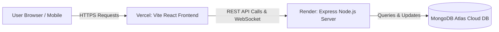

# 🚀 CCMS Deployment Guide: Render (Backend) & Vercel (Frontend)

This guide provides a complete, step-by-step walkthrough for deploying the **College Complaint Management System (CCMS)** to production using **Render** for the backend API and **Vercel** for the Vite/React frontend.

---

## 📑 Table of Contents
1. [Architecture Overview](#-architecture-overview)
2. [Pre-Deployment Checklist](#-pre-deployment-checklist)
3. [Step 1: Push Project to GitHub](#step-1-push-project-to-github)
4. [Step 2: Setup MongoDB Atlas (Cloud Database)](#step-2-setup-mongodb-atlas-cloud-database)
5. [Step 3: Deploy Backend on Render](#step-3-deploy-backend-on-render)
6. [Step 4: Deploy Frontend on Vercel](#step-4-deploy-frontend-on-vercel)
7. [Step 5: Connect Frontend & Backend (Final Sync)](#step-5-connect-frontend--backend-final-sync)
8. [Step 6: Seed Database in Production (Optional)](#step-6-seed-database-in-production-optional)
9. [🔧 Troubleshooting & FAQs](#-troubleshooting--faqs)

---

## 🏗️ Architecture Overview



- **Frontend**: React 18 + Vite SPA deployed on **Vercel** with automatic client-side route rewrites.
- **Backend**: Node.js / Express + Socket.IO Web Service deployed on **Render**.
- **Database**: Cloud-hosted **MongoDB Atlas** database cluster.

---

## ✅ Pre-Deployment Checklist

Before deploying, ensure the following configurations are in place (already configured in this repository):
- [x] `.gitignore` created to prevent pushing `.env` and `node_modules`.
- [x] `client/vercel.json` configured to support React Router SPA routing on page reload.
- [x] `client/src/services/api.js` updated to read dynamic backend URL via `VITE_API_URL`.
- [x] `client/src/store/socketContext.jsx` updated to read Socket URL via `VITE_SOCKET_URL` / `VITE_API_URL`.
- [x] Backend CORS configured to accept requests from your Vercel domain.

---

## Step 1: Push Project to GitHub

1. Open your terminal in the project root directory (`project4`):
   ```bash
   cd c:\Projects\project4
   ```

2. Initialize Git (if not already initialized):
   ```bash
   git init
   ```

3. Stage all files (the `.gitignore` will automatically exclude `.env` and `node_modules`):
   ```bash
   git add .
   ```

4. Commit the changes:
   ```bash
   git commit -m "Initial commit - Ready for deployment"
   ```

5. Create a new repository on [GitHub](https://github.com/new) (e.g. `ccms-college-complaint-management`).

6. Link your local repository to GitHub and push:
   ```bash
   git remote add origin https://github.com/<YOUR_GITHUB_USERNAME>/<YOUR_REPOSITORY_NAME>.git
   git branch -M main
   git push -u origin main
   ```

---

## Step 2: Setup MongoDB Atlas (Cloud Database)

Render requires a cloud MongoDB database to persist data.

1. Go to [MongoDB Atlas](https://www.mongodb.com/cloud/atlas) and sign in / register.
2. Create a **Shared Cluster (M0 Free Tier)**.
3. Under **Security > Database Access**:
   - Click **Add New Database User**.
   - Choose **Password Authentication**.
   - Create a username and strong password (save these!).
   - Set user privileges to **Read and write to any database**.
4. Under **Security > Network Access**:
   - Click **Add IP Address**.
   - Select **Allow Access from Anywhere** (`0.0.0.0/0`) so Render servers can connect.
   - Click **Confirm**.
5. Under **Deployments > Database**:
   - Click **Connect** on your cluster.
   - Select **Drivers** (Node.js).
   - Copy your connection string. It will look like:
     ```
     mongodb+srv://<username>:<password>@cluster0.xxxxxx.mongodb.net/ccms?retryWrites=true&w=majority
     ```
   - Replace `<username>` and `<password>` with your database credentials and set the database name to `ccms`.

---

## Step 3: Deploy Backend on Render

1. Go to [Render Dashboard](https://dashboard.render.com/) and sign in with GitHub.
2. Click **New +** and select **Web Service**.
3. Select **Build and deploy from a Git repository** and connect your GitHub repository.
4. Fill in the service configuration:

   | Setting | Value |
   | :--- | :--- |
   | **Name** | `ccms-backend` (or any unique name) |
   | **Region** | Choose the closest region (e.g., Singapore, Oregon, Frankfurt) |
   | **Branch** | `main` |
   | **Root Directory** | `server` |
   | **Runtime** | `Node` |
   | **Build Command** | `npm install` |
   | **Start Command** | `npm start` |
   | **Instance Type** | `Free` |

5. Scroll down to **Environment Variables** and add the following keys:

   | Key | Value | Notes |
   | :--- | :--- | :--- |
   | `NODE_ENV` | `production` | Production mode |
   | `MONGO_URI` | `mongodb+srv://<username>:<password>@...` | Your MongoDB Atlas connection string |
   | `JWT_SECRET` | `your_super_secret_jwt_key_2026` | Any long, random secret key |
   | `JWT_EXPIRES_IN` | `7d` | Token expiration |
   | `CLIENT_URL` | `*` *(or your Vercel URL once deployed)* | Allowed CORS origin |

6. Click **Create Web Service**.
7. Wait for the build to finish. Once live, Render will provide your public backend URL at the top of the page, e.g.:
   ```
   https://ccms-backend-xxxx.onrender.com
   ```
8. Verify the backend is working by visiting in your browser:
   ```
   https://ccms-backend-xxxx.onrender.com/api/health
   ```
   You should see: `{"status":"ok","message":"CCMS API Server is operational"}`.

---

## Step 4: Deploy Frontend on Vercel

1. Go to [Vercel Dashboard](https://vercel.com/dashboard) and sign in with GitHub.
2. Click **Add New... > Project**.
3. Import your GitHub repository.
4. In the **Configure Project** screen:
   - **Project Name**: `ccms-frontend` (or any name)
   - **Framework Preset**: `Vite`
   - **Root Directory**: Click **Edit** and select `client`
5. Expand the **Environment Variables** section and add:

   | Key | Value |
   | :--- | :--- |
   | `VITE_API_URL` | `https://ccms-backend-xxxx.onrender.com` *(Your Render URL without trailing slash)* |
   | `VITE_SOCKET_URL` | `https://ccms-backend-xxxx.onrender.com` *(Your Render URL)* |

6. Click **Deploy**.
7. Vercel will build and deploy your Vite app in ~30-60 seconds.
8. Once complete, you will receive your production domain, e.g.:
   ```
   https://ccms-frontend-xxxx.vercel.app
   ```

---

## Step 5: Connect Frontend & Backend (Final Sync)

Now that both services are deployed:

1. Copy your Vercel URL (e.g. `https://ccms-frontend-xxxx.vercel.app`).
2. Go back to your **Render Dashboard** > select your `ccms-backend` Web Service > **Environment**.
3. Update `CLIENT_URL` to match your Vercel domain:
   ```
   CLIENT_URL = https://ccms-frontend-xxxx.vercel.app
   ```
4. Click **Save Changes**. Render will automatically redeploy with the updated CORS rule.

---

## Step 6: Seed Database in Production (Optional)

To initialize default departments, admin accounts, and sample complaints in your MongoDB Atlas database:

### Option A: Using Render Shell (Recommended)
1. In your Render backend dashboard, click the **Shell** tab on the left menu.
2. Run the seed script:
   ```bash
   npm run seed
   ```
3. You will see confirmation logs that departments, admin users, and sample data have been created.

### Option B: Run Seed Locally Pointing to Atlas
From your local terminal, run:
```bash
cd server
MONGO_URI="your_mongodb_atlas_connection_string" npm run seed
```

### 🔑 Default Seeded Credentials:
- **Administrator**:
  - Email: `admin@college.edu`
  - Password: `AdminPassword123!`
- **Sample Student**:
  - Email: `student1@college.edu`
  - Password: `StudentPassword123!`

---

## 🔧 Troubleshooting & FAQs

### 1. Render Free Tier Cold Starts
- **Issue**: The first request after 15 minutes of inactivity takes 30-50 seconds to respond.
- **Why**: Render free tier spins down instances during inactivity.
- **Solution**: This is normal on free tiers. Subsequent requests are fast. For 24/7 instant response, upgrade to Render Starter ($7/mo) or use a free uptime monitor (e.g., UptimeRobot) to ping `/api/health` every 10 minutes.

### 2. Page Reload gives 404 on Vercel
- **Solution**: Ensure [client/vercel.json](file:///c:/Projects/project4/client/vercel.json) is present in the `client` directory with the rewrite rule to `index.html`. This ensures React Router handles all sub-routes.

### 3. Socket.IO Connection Issues
- **Solution**: Verify that `VITE_SOCKET_URL` in Vercel environment variables points to your exact Render URL (e.g. `https://ccms-backend.onrender.com`) without a trailing `/api`.

### 4. CORS Errors in Browser Console
- **Solution**: Ensure `CLIENT_URL` in Render's environment variables matches your exact Vercel frontend URL including `https://` (no trailing slash).

---

🎉 **Congratulations! Your College Complaint Management System is now live in production!**
